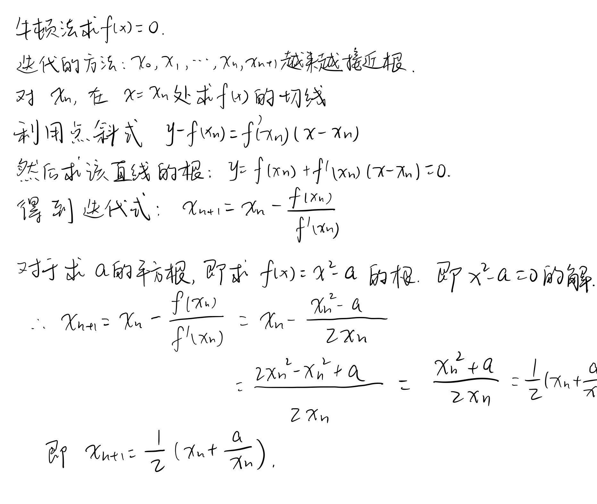
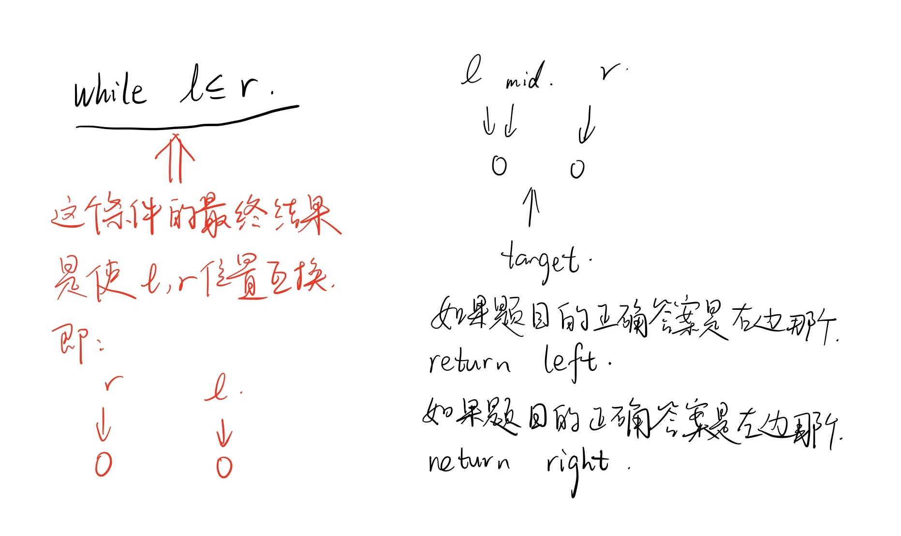

## x的平方根
**题目**：
实现 int sqrt(int x) 函数。

计算并返回 x 的平方根，其中 x 是非负整数。

由于返回类型是整数，结果只保留整数的部分，小数部分将被舍去。


**示例**：
```
输入: 4
输出: 2
```
```
输入: 8
输出: 2
说明: 8 的平方根是 2.82842..., 
     由于返回类型是整数，小数部分将被舍去。
```

思路：二分查找

**submission 1**:
```python
class Solution:
    def mySqrt(self, x: int) -> int:
        if x < 2:
            return x
        l, r = 0, x//2
        while l<=r:
            mid = (l+r)//2
            a = mid*mid
            if a == x:
                return mid
            elif a > x:
                r = mid - 1
            else:
                l = mid + 1
        return r
```


**改进思路1**：
牛顿法，只要明白了原理并完成数学推导，实现上非常简单。


**submission 2**：
```python
class Solution:
    def mySqrt(self, x: int) -> int:
        if x < 2:
            return x
        x0 = x/2
        x1 = 0.5*(x0+x/x0)
        while abs(x0-x1) >= 1:
            x0 = x1
            x1 = 0.5*(x0+x/x0)
        return int(x1)
```


**改进思路2**：
公式法

**submission 3**：
```python
from math import e, log
class Solution:
    def mySqrt(self, x):
        if x < 2:
            return x
        
        left = int(e**(0.5 * log(x)))
        right = left + 1
        return left if right * right > x else right
```


**改进思路3**：
递归法：$\sqrt{x} = 2 \times \sqrt{x/4}$
乘法和除法用移位操作代替提高实现效率。

**submission 4**：
```python
from math import e, log
class Solution:
    def mySqrt(self, x):
        if x < 2:
            return x
        
        left = self.mySqrt(x>>2)<<1
        right = left + 1
        return left if right * right > x else right
```


<font color="#FF0000">**Attention**</font>:

- 二分法的万能总结
  

