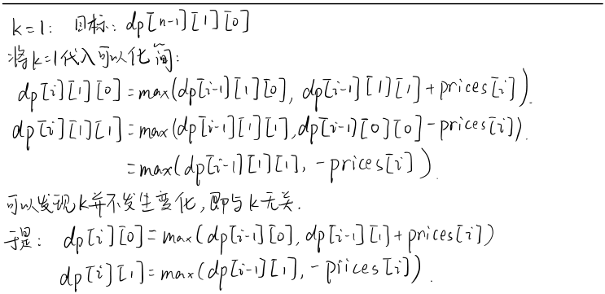
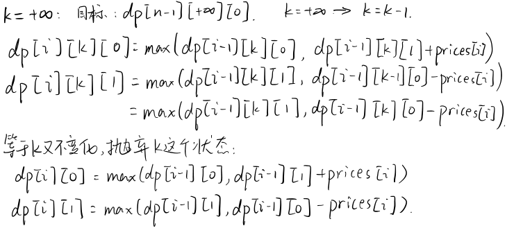
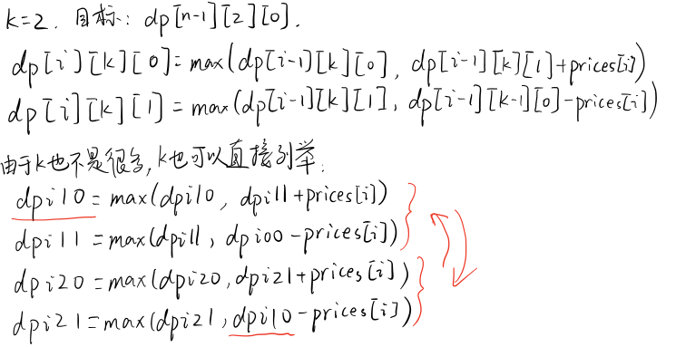
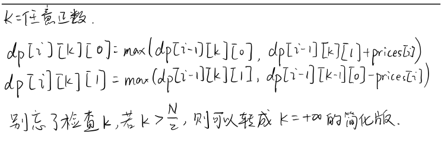

## 买股票问题
3个状态：
* i：第i天
* k：进行了几次交易
* r：0/1表示是否持有股票


### 买股票1


```python
class Solution:
    def maxProfit(self, prices: List[int]) -> int:
        dp_i_0 = 0
        dp_i_1 = -float('inf')
        for i in range(len(prices)):
            dp_i_0 = max(dp_i_0, dp_i_1+prices[i])
            dp_i_1 = max(dp_i_1,-prices[i])
        return dp_i_0
```

### 买股票2


```python
class Solution:
    def maxProfit(self, prices: List[int]) -> int:
        dp_i_0 = 0
        dp_i_1 = -float('inf')
        for i in range(len(prices)):
            temp = dp_i_0
            dp_i_0 = max(dp_i_0, dp_i_1+prices[i])
            dp_i_1 = max(dp_i_1, temp-prices[i])
        return dp_i_0
```

### 买股票3


```python
class Solution:
    def maxProfit(self, prices: List[int]) -> int:
        if len(prices) == 0:
            return 0
        dp = [[[0 for i in range(2)] for j in range(3)] for k in range(len(prices))]
        for i in range(len(prices)):
            dp[i][0][0] = 0
            dp[i][0][1] = -float('inf')
        for i in range(len(prices)):
            for k in range(1,3):
                if i == 0:
                    dp[i][k][0] = max(0, -float('inf')+prices[i])
                    dp[i][k][1] = max(-float('inf'), 0-prices[i])
                else:
                    dp[i][k][0] = max(dp[i-1][k][0], dp[i-1][k][1]+prices[i])
                    dp[i][k][1] = max(dp[i-1][k][1], dp[i-1][k-1][0]-prices[i])
        return dp[len(prices)-1][2][0]
```

### 买股票4


```python
class Solution:
    def maxProfit(self, k: int, prices: List[int]) -> int:
        if len(prices) == 0:
            return 0
        if k < len(prices)/2:
            dp = [[[0 for i in range(2)] for j in range(k+1)] for l in range(len(prices))]
            for i in range(len(prices)):
                for k in range(1,k+1):
                    if i == 0:
                        dp[i][k][0] = max(0, -float('inf')+prices[i])
                        dp[i][k][1] = max(-float('inf'), 0-prices[i])
                    else:
                        dp[i][k][0] = max(dp[i-1][k][0], dp[i-1][k][1]+prices[i])
                        dp[i][k][1] = max(dp[i-1][k][1], dp[i-1][k-1][0]-prices[i])
            return dp[len(prices)-1][k][0]
        else:
            dp_i_0 = 0
            dp_i_1 = -float('inf')
            for i in range(len(prices)):
                temp = dp_i_0
                dp_i_0 = max(dp_i_0, dp_i_1+prices[i])
                dp_i_1 = max(dp_i_1, temp-prices[i])
            return dp_i_0
```