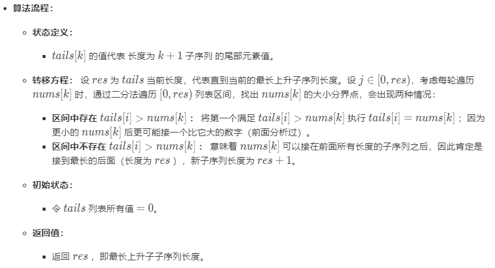

## 最长上升子序列
**题目**：
给定一个无序的整数数组，找到其中最长上升子序列的长度。

说明:

- 可能会有多种最长上升子序列的组合，你只需要输出对应的长度即可。
- 你算法的时间复杂度应该为 O(n2) 。
- 进阶: 你能将算法的时间复杂度降低到 O(n log n) 吗?


**示例**：
```
输入: [10,9,2,5,3,7,101,18]
输出: 4 
解释: 最长的上升子序列是 [2,3,7,101]，它的长度是 4。
```

算法1：动态规划
- dp[i]: 以num[i]结尾的最长上升子序列的长度
- ```dp[i] = max(dp[i], dp[j]+1) for j in range(0,i) if nums[j] < nums[i]```

**submission 1**:
```python
class Solution:
    def lengthOfLIS(self, nums: List[int]) -> int:
        if len(nums) < 2:
            return len(nums)
        max_dp = 0
        dp = [1]*len(nums)
        for i in range(1,len(nums)):
            for j in range(0,i):
                if nums[j] < nums[i]:
                    dp[i] = max(dp[i], dp[j]+1)
            max_dp = max(max_dp, dp[i])
        return max_dp
```

**改进思路1**：


**submission 2**：
```python
class Solution:
    def lengthOfLIS(self, nums: List[int]) -> int:
        if len(nums) < 2:
            return len(nums)
        tails = [0]*len(nums)
        res = 0
        for num in nums:
            i, j = 0, res
            # 查找tails中第一个大于num的数的位置
            while i<j:   #开区间查找[i,j),结束条件为i == j
                m = (i+j)//2
                if tails[m] < num:
                    i = m + 1
                else:
                    j = m
            tails[j] = num
            if j == res:
                res += 1
        return res
```


<font color="#FF0000">**Attention**</font>:

- 
