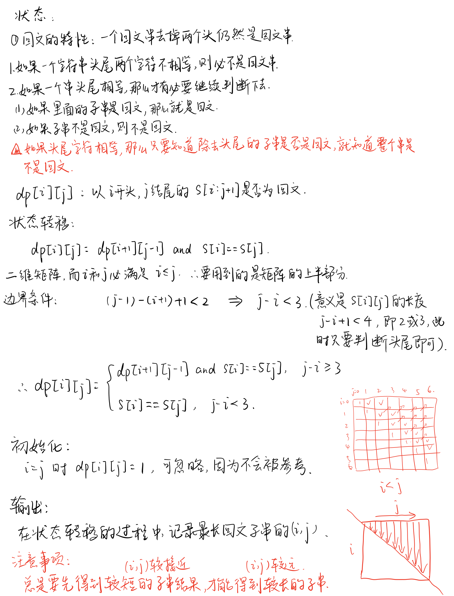

## 最长回文子串
**题目**：
给定一个字符串 s，找到 s 中最长的回文子串。你可以假设 s 的最大长度为 1000。

**示例**：
```
输入: "babad"
输出: "bab"
注意: "aba" 也是一个有效答案。
```
```
输入: "cbbd"
输出: "bb"
```

基本思路：暴力匹配，超时。

**submission 1**:
```python
class Solution:
    # 暴力匹配（超时）
    def longestPalindrome(self, s: str) -> str:
        # 特判
        size = len(s)
        if size < 2:
            return s

        max_len = 1
        res = s[0]

        # 枚举所有长度大于等于 2 的子串
        for i in range(size - 1):
            for j in range(i + 1, size):
                if j - i + 1 > max_len and self.__valid(s, i, j):
                    max_len = j - i + 1
                    res = s[i:j + 1]
        return res

    def __valid(self, s, left, right):
        # 验证子串 s[left, right] 是否为回文串
        while left < right:
            if s[left] != s[right]:
                return False
            left += 1
            right -= 1
        return True
```


**改进思路1**：
动态规划



**submission 2**：
```python
class Solution:
    def longestPalindrome(self, s: str) -> str:
        size = len(s)
        if size < 2:
            return s
        max_len = (0, 0)
        dp = [[False for _ in range(size)] for __ in range(size)]

        for j in range(size):
            for i in range(0,j):
                if j - i < 3:
                    dp[i][j] = s[i] == s[j]
                else:
                    dp[i][j] = s[i] == s[j] and dp[i+1][j-1]
                if dp[i][j] and (j - i) > (max_len[1] - max_len[0]):
                    max_len = (i, j)
        return s[max_len[0]:max_len[1]+1]
# or
class Solution:
    def longestPalindrome(self, s: str) -> str:
        if not s:
            return ''
        n = len(s)
        dp = [[False for _ in range(n)] for _ in range(n)]
        res = s[0]
        for j in range(1,n):
            for i in range(j):
                dp[i][j] = s[i]==s[j] and (j-i<3 or dp[i+1][j-1])
                if dp[i][j] and j-i+1 > len(res):
                    res = s[i:j+1]
        return res
```


**改进思路2**：
中心扩散法

**submission 3**：
```python
class Solution:
    def longestPalindrome(self, s: str) -> str:
        size = len(s)
        if size < 2:
            return s

        # 至少是 1
        max_len = 1
        res = s[0]

        for i in range(size):
            palindrome_odd, odd_len = self.__center_spread(s, size, i, i)
            palindrome_even, even_len = self.__center_spread(s, size, i, i + 1)

            # 当前找到的最长回文子串
            cur_max_sub = palindrome_odd if odd_len >= even_len else palindrome_even
            if len(cur_max_sub) > max_len:
                max_len = len(cur_max_sub)
                res = cur_max_sub

        return res

    def __center_spread(self, s, size, left, right):
        """
        left = right 的时候，此时回文中心是一个字符，回文串的长度是奇数
        right = left + 1 的时候，此时回文中心是一个空隙，回文串的长度是偶数
        """
        i = left
        j = right

        while i >= 0 and j < size and s[i] == s[j]:
            i -= 1
            j += 1
        return s[i + 1:j], j - i - 1
```


**改进思路3**：
Manacher算法

**submission 4**：
```python

```


<font color="#FF0000">**Attention**</font>:

- 
